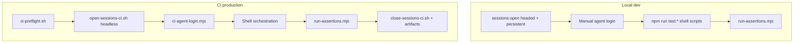

# Playwright CLI — production practices for this repo

How upstream Playwright CLI guidance maps to **poc-playwright-cli**: local dev vs CI, hardening the video E2E pipeline, and promoting shell flows to `@playwright/test` specs.

See also: [COBROWSE_POC.md](./COBROWSE_POC.md) (local runbook), [CI.md](./CI.md) (GitHub Actions).

---

## Architecture today



| Layer | Local | CI |
|-------|-------|-----|
| Config | `.playwright/cli.config.json` | `.playwright/cli.config.ci.json` via `PLAYWRIGHT_CLI_CONFIG` |
| Sessions | `-s=visitor`, `-s=agent`, `--headed --persistent` | Headless, no `--persistent` |
| Auth | Manual in browser | `GLANCE_AGENT_*` secrets → `ci-agent-login.mjs` |
| Validation | `tests/run-assertions.mjs` | Same runner, `CI=1` |
| Cleanup | `sessions:close` | `close-all` + `kill-all` trap in `ci-e2e-video.sh` |

---

## CI hardening checklist

Use this when changing the pipeline or debugging flakes. Status reflects the repo **as of this doc**.

### Configuration

| Item | Status | Where |
|------|--------|-------|
| Separate CI config (headless, timeouts, artifacts) | Done | `.playwright/cli.config.ci.json` |
| Fixed viewport in CI | Done | `contextOptions.viewport` in CI config |
| `outputMode: "file"` for log capture | Done | CI config |
| Fake media devices for headless video | Done | `--use-fake-ui-for-media-stream` launch args |
| Env wired through `playwright-cli-env.sh` | Done | `scripts/lib/playwright-cli-env.sh` |
| Secrets never in repo / prompts | Done | `.env` gitignored, GitHub Secrets |

### Pipeline lifecycle

| Item | Status | Where |
|------|--------|-------|
| `set -euo pipefail` on orchestration scripts | Done | `ci-e2e-video.sh`, step scripts |
| Preflight before opening browsers | Done | `scripts/ci-preflight.sh` |
| Fail-fast secret validation (before sessions) | Done | Preflight + `ci-agent-login.sh` |
| `trap` → capture artifacts → close sessions | Done | `ci-e2e-video.sh` `on_exit` |
| Tracing started for both sessions in CI | Done | `ci-e2e-video.sh` after open |
| Failure snapshots + screenshots | Done | `ci-capture-failure-artifacts.sh` |
| Console log dump on failure | Done | `ci-capture-failure-artifacts.sh` |
| Upload artifacts on workflow failure | Done | `.github/workflows/cobrowse-e2e.yml` |
| Concurrency cancel-in-progress | Done | Workflow `concurrency` block |
| Job timeout (45m) | Done | Workflow |

### Session hygiene

| Item | Status | Where |
|------|--------|-------|
| Semantic session names (`visitor`, `agent`) | Done | All scripts |
| No `--persistent` in CI | Done | `open-sessions-ci.sh` |
| Always `close-all` + `kill-all` on exit | Done | `close-sessions-ci.sh` |
| Re-snapshot after navigation (refs go stale) | Documented | COBROWSE_POC troubleshooting |

### Observability gaps (recommended next)

| Item | Status | Notes |
|------|--------|-------|
| Trace upload in GitHub Artifacts | Partial | Traces under `.playwright-cli/traces/` — confirm zip includes them |
| `state-save` / `state-load` for MFA accounts | Documented | [CI.md](./CI.md) storage-state fallback |
| Pin `@playwright/cli` in lockfile | Done | `package-lock.json` |
| Run workflow on `pull_request` | Optional | Currently `push` only |
| Shard / parallel jobs | N/A | Dual-session flow is inherently sequential |
| Block analytics origins in CI config | Optional | `network.blockedOrigins` in cli config |

### Local vs CI parity

| Item | Action |
|------|--------|
| Reproduce CI locally | `export PLAYWRIGHT_CLI_CONFIG=.playwright/cli.config.ci.json CI=1` then `npm run test:ci:e2e:video` |
| Debug headless-only failures | Run same env locally; inspect `ci-failure/` artifacts |
| Debug with traces | `npx playwright-cli show-trace .playwright-cli/traces/...` (after failure capture) |

---

## File reference

| Purpose | Path |
|---------|------|
| CI entrypoint | `scripts/ci-e2e-video.sh` |
| Preflight | `scripts/ci-preflight.sh` |
| Open / close CI sessions | `scripts/open-sessions-ci.sh`, `scripts/close-sessions-ci.sh` |
| Failure capture | `scripts/ci-capture-failure-artifacts.sh` |
| Assertion definitions | `tests/cases/*.json`, `tests/run-assertions.mjs` |
| Spec plan (promotion target) | `specs/cobrowse-video.plan.md` |
| Playwright test bootstrap (future) | `tests/playwright/*.example` |

---

## Promoting CLI flows to `@playwright/test`

Today this repo orchestrates via **bash + playwright-cli + assertion runner**. For production scale, migrate durable steps into Playwright Test files using Microsoft's **spec-driven** workflow (see `.agents/skills/playwright-cli/references/spec-driven-testing.md`).

### Phase 1 — Plan (done for video flow)

- Spec file: [`specs/cobrowse-video.plan.md`](../specs/cobrowse-video.plan.md)
- Mirrors existing case: `tests/cases/start-cobrowse-session-with-video.md`

### Phase 2 — Bootstrap Playwright Test (done)

```bash
npm install   # includes @playwright/test
npm run test:pw:install
npm run test:pw:ci -- tests/playwright/visitor/configure-cobrowse-settings.spec.ts
```

Files:
- `playwright.config.ts` — CI + local projects
- `tests/playwright/fixtures.ts` — shared env (`cobrowseEnv`)
- `tests/playwright/cobrowse-seed.spec.ts` — seed for `--debug=cli` generation
- `tests/playwright/visitor/configure-cobrowse-settings.spec.ts` — first migrated spec (scenario 1.1)

**Note:** Staging radio triggers an ASP.NET postback that resets group id; wait for the POST response before re-filling (see the spec).

### Phase 3 — Generate from spec

For each scenario in the plan:

```bash
PLAYWRIGHT_HTML_OPEN=never npx playwright test tests/playwright/cobrowse-seed.spec.ts --debug=cli
# wait for tw-XXXX in output
npx playwright-cli attach tw-XXXX
npx playwright-cli resume
# walk scenario steps; copy emitted TypeScript into tests/playwright/<group>/<scenario>.spec.ts
```

Rules from upstream:

- **One test per file**; scenario name = file name (kebab-case).
- **Never** open the app URL directly if the seed sets up auth — go through the seed test.
- **Never** fix flakes with sleeps or `networkidle`.
- Close CLI session and stop background test before the next scenario.

### Phase 4 — CI integration

Replace or wrap shell steps with:

```yaml
- run: npx playwright test tests/playwright --project=ci
  env:
    GLANCE_AGENT_USER: ${{ secrets.GLANCE_AGENT_USER }}
    GLANCE_AGENT_PASSWORD: ${{ secrets.GLANCE_AGENT_PASSWORD }}
```

Keep dual-browser flows as **two browser contexts** in one test, or use `playwright-cli -s=visitor` / `-s=agent` from a `test.step` shell helper until fully migrated.

### Mapping: current scripts → future specs

| Current script | Plan scenario | Future spec file |
|----------------|---------------|------------------|
| `test-configure-visitor.sh` | 1.1 | `tests/playwright/visitor/configure-cobrowse-settings.spec.ts` |
| `test-start-visitor-cobrowse.sh` | 1.2 | `tests/playwright/visitor/start-cobrowse-session.spec.ts` |
| `ci-agent-login.mjs` + join | 2.1 | `tests/playwright/agent/join-with-session-code.spec.ts` |
| `test-prepare-post-join.sh` | 2.2 | `tests/playwright/video/enable-agent-video.spec.ts` |
| `run-assertions.mjs --group video` | 2.3 | Inline `expect()` in video spec (replace JSON validators gradually) |

---

## Quick commands

```bash
# Local production-like dry-run
export GLANCE_AGENT_USER="..." GLANCE_AGENT_PASSWORD="..."
export PLAYWRIGHT_CLI_CONFIG=.playwright/cli.config.ci.json CI=1
npm run test:ci:e2e:video

# Preflight only
bash scripts/ci-preflight.sh

# After CI failure — inspect artifacts locally
ls -la .playwright-cli/ci-failure/ ci-artifacts/
```
